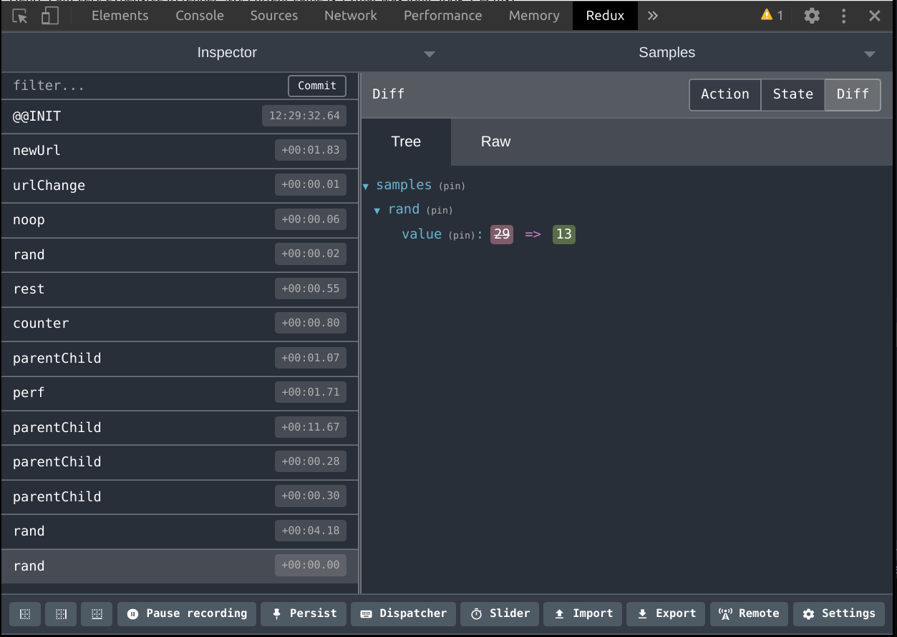

`react-tea-cup` includes developer tools for easier debugging and boosted productivity.

# Principles

TeaCup DevTools is basically like the Redux DevTools : it leverages 
the Model's immutability, and TEA, to help "debugging" and 
understanding what happens in your app :

* Records the Model before and after every update
* Time travel to previous Model states
* Init application with Model snapshot

# Activate Dev Tools

DevTools must be setup at application sartup time. You need to pass a `DevTools` instance
to the `Program`, like this :

```typescript jsx

import { DevTools } from "react-tea-cup";

// ...

<Program
    init={init}
    view={view}
    update={update}
    subscriptions={subscriptions}
    devTools={DevTools.init<Model,Msg>(window)}
/>
```

# Usage

TeaCup DevTools are available as `teaCupDevTools` on the `window`. You can interact with the object in 
the browser's console :

    const model12 = teaCupDevTools.events[12].modelAfter;
    const lastModel = teaCupDevTools.lastModel();
    teaCupDevTools.travelTo(12);
    teaCupDevTools.forward();

> Check out the DevTools class for more info about available methods.

# Snapshots 

One of the annying things in developing front-ends is that sometimes loose context on refresh. Therefore, in order to see the results of a change in the code, you often need to "navigate" in the app in order to get to the desired state. This repetitive process is boring and time-consuming.

This is where "snapshots" can help.

TeaCup DevTools allows to tak a snapshot of the app at any moment :

    teaCupDevTools.snapshot();

This serializes the whole Model, and puts it into local storage. At next app startup, if there's a snapshot, then DevTools will deserialize the Model from local storage, and boot the app with it instead of calling your `init` function.

Once you are done, you can clear the snapshot by :

    teaCupDevTools.clearSnapshot();

Your app will now boot as usual.

## Serialization constraints

Snapshots only work with "serializable" Models. This implies limitations on what you can put in your Model. 

By default, all _data_ types are allowed :

* primitives (string, number etc)
* pure data objects
* dates
* user-defined classes (see below) 

TeaCup DevTools have an `ObjectSerializer` to handle serialization of JS objects with methods. It can 
(de)serialize TS classes, by re-assigning the prototype in order to keep the methods.

The built-in classes (e.g. `List` or `Maybe`) are handled by default. If you write classes, then you'll need to register those
to an `ObjectSerializer` and pass this one to the `DevTools` :

```typescript jsx
// serializer for TeaCup DevTools
const serializer: ObjectSerializer = ObjectSerializer
  .withTeaCupClasses()  // setup built-in classes
  .addClasses([         // add my classes
    MyClass,
    MyOtherClass
  ]);
​
export const Main = (props: MainProps) => {
  return (
    <Program
      init={() => Dashboards.init(props.flags)}
      view={view}
      update={Dashboards.update}
      subscriptions={Dashboards.subscriptions}
      devTools={DevTools.init<Model, Msg>(window, serializer)}
    />
  );
};
```

# Redux DevTools

> This is work in progress, use at your own risk !

tea-cup's dev tools can also work with the [Redux dev tools](https://chrome.google.com/webstore/detail/redux-devtools/lmhkpmbekcpmknklioeibfkpmmfibljd) extension, for a more "graphical experience" :



Hook it like this :

      devTools={withReduxDevTools(DevTools.init<Model, Msg>(window, serializer))}

